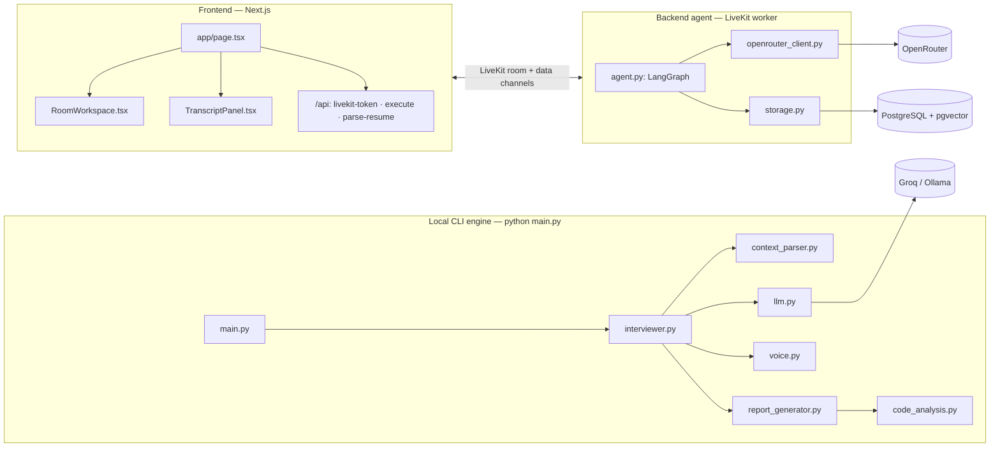

# HireMind AI

AI-powered technical interview platform. It runs DSA, system-design, resume, and
behavioral interviews with contextual question generation, real-time voice, live
code execution, and explainable scoring reports.

The repo has three independent components:

| Component | Path | What it is |
|-----------|------|-----------|
| **Local CLI engine** | repo root (`main.py`, `interviewer.py`, …) | Single-machine terminal interview with voice + a PDF report. Uses Groq (or local Ollama). |
| **Backend agent** | `backend/` | A LiveKit worker running a LangGraph state machine (Evaluator → Tracker → Questioner), OpenRouter LLM, and PostgreSQL + pgvector persistence. |
| **Frontend** | `frontend/` | A Next.js browser room: resume upload, LiveKit audio/screen-share, Monaco editor, live transcript. |

---

## Architecture


```mermaid
flowchart LR
  subgraph CLI["Local CLI engine — python main.py"]
    M[main.py] --> I[interviewer.py]
    I --> CP[context_parser.py]
    I --> L[llm.py]
    I --> V[voice.py]
    I --> R[report_generator.py]
    R --> CA[code_analysis.py]
  end

  subgraph FE["Frontend — Next.js"]
    PG[app/page.tsx] --> RW[RoomWorkspace.tsx]
    PG --> TP[TranscriptPanel.tsx]
    PG --> APIR["/api: livekit-token · execute · parse-resume"]
  end

  subgraph BE["Backend agent — LiveKit worker"]
    AG[agent.py: LangGraph] --> OR[openrouter_client.py]
    AG --> ST[storage.py]
  end

  FE <-->|LiveKit room + data channels| BE
  ST --> DB[(PostgreSQL + pgvector)]
  L --> LP[(Groq / Ollama)]
  OR --> OO[(OpenRouter)]
```

The CLI engine and the LiveKit backend are two separate ways to run an interview;
they share design ideas (prompts, scoring, persistence concepts) but run on their own.

---

## Prerequisites

- Python 3.10+
- Node.js 20+ (frontend)
- Docker (optional, for LiveKit + PostgreSQL via `docker-compose.yml`)
- An LLM key: Groq (CLI) and/or OpenRouter (backend). Ollama works locally with no key.

Copy the env template and fill in what you need:

```bash
cp .env.example .env                 # CLI + backend
cp frontend/.env.example frontend/.env.local   # frontend
```

---

## 1. Local CLI engine

```bash
python3 -m venv .venv && source .venv/bin/activate
pip install -r requirements.txt
export GROQ_API_KEY=...        # or run with --local to use Ollama
python3 main.py
```

Useful flags:

```bash
python3 main.py --jd-path ./jd.txt --resume-path ./resume.txt
python3 main.py --topic graphs --diff hard
python3 main.py --watch ../solution.py     # react to code edits
python3 main.py --no-voice                 # text-only
python3 main.py --local                    # force local Ollama
```

Voice is cross-platform: macOS `say`, Linux `espeak-ng`/`espeak`, or Windows
PowerShell. If no engine is found, the bot runs text-only automatically. On Linux
install one with `apt-get install espeak-ng`. At the end of a session the bot writes
an `interview_evaluation.pdf` with competency scores and a static code-analysis
section (cyclomatic complexity, loop nesting, recursion, and rough time/space hints).

---

## 2. Backend agent (LiveKit + LangGraph)

```bash
cd backend
python3 -m venv .venv && source .venv/bin/activate
pip install -r requirements.txt
# env: OPENROUTER_API_KEY, GOOGLE_API_KEY, LIVEKIT_*, DATABASE_URL (see ../.env.example)
python agent.py dev
```

- The agent reads `../.env.local` if present, otherwise falls back to `../.env`.
- LLM calls retry with backoff and degrade gracefully (a failed turn logs and
  continues rather than crashing the worker).
- Persistence is optional: without `DATABASE_URL` the agent runs but does not store
  sessions. With it, `storage.py` provides `get_session`, `list_sessions`,
  `get_events`, `get_skill_scores`, `export_session`, and `delete_session` (GDPR).

Start LiveKit + PostgreSQL locally with Docker:

```bash
docker compose up -d
```

---

## 3. Frontend (Next.js)

```bash
cd frontend
npm install
# env: LIVEKIT_API_KEY, LIVEKIT_API_SECRET, NEXT_PUBLIC_LIVEKIT_URL, … (see frontend/.env.example)
npm run dev      # http://localhost:3001
```

API routes:

- `app/api/livekit-token/route.ts` — mints LiveKit access tokens.
- `app/api/execute/route.ts` — runs code via Piston, with an optional local fallback
  (`EXECUTE_FALLBACK=local`, demos only).
- `app/api/parse-resume/route.ts` — extracts text from uploaded PDF/TXT/MD/CSV.

---

## Testing

```bash
pip install -r requirements.txt -r requirements-dev.txt
pytest
```

The suite covers the context parser, report normalization + PDF generation, the
cross-platform voice engine selection, the code-complexity analyzer, and the
storage layer's disabled-mode behavior. Storage DB-backed tests are skipped if
`psycopg` is not installed.

---

## Project structure

```text
.
├── main.py interviewer.py context_parser.py llm.py prompts.py
├── report_generator.py code_analysis.py voice.py watcher.py ui.py config.py
├── requirements.txt requirements-dev.txt .env.example
├── tests/                      # pytest suite
├── backend/
│   ├── agent.py                # LiveKit worker + LangGraph
│   ├── openrouter_client.py storage.py
│   ├── db/init.sql Dockerfile fly.toml
├── frontend/
│   ├── app/ (page.tsx, layout.tsx, api/…)
│   ├── components/ (RoomWorkspace, InterviewSidebar, TranscriptPanel)
│   └── lib/types.ts .env.example
├── docker-compose.yml livekit.yaml vercel.json
```

---

## Deployment

- **Frontend → Vercel:** deploy from `frontend/`; set `LIVEKIT_*` and
  `NEXT_PUBLIC_LIVEKIT_URL`.
- **Backend → Fly.io:** `fly deploy -c backend/fly.toml`; set `OPENROUTER_API_KEY`,
  `GOOGLE_API_KEY`, `LIVEKIT_*`, and `DATABASE_URL` as secrets.
- **Local stack:** `docker compose up -d` for LiveKit + PostgreSQL (pgvector).

Never commit filled-in `.env*` files — only the `.env.example` templates are tracked.
